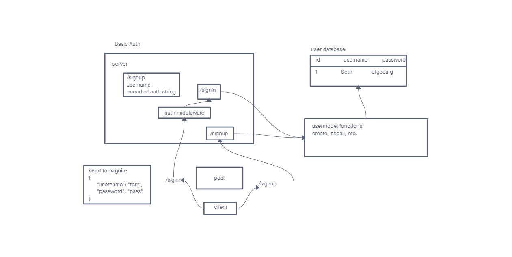

# LAB - Class 06

## Project: basic-auth

### Author: Seth Pierce

### Problem Domain

  Deploy an Express server that implements Basic Authentication, with signup and signin capabilities, using a Postgres database for storage.

### Links and Resources

- [ci/cd](https://github.com/sethppierce/basic-auth/actions) (GitHub Actions)
- [prod deployment](https://auth-9yk4.onrender.com) (when applicable)

### Setup

#### `.env` requirements (where applicable)

- PORT: 3001
- DATABASE_URL=postgres://localhost:5432/api-app-auth?sslmode=disable

#### How to initialize/run your application (where applicable)

- nodemon

#### Features / Routes

- Feature One - signup
- POST - path `/signup` creates a user with hased password
- Feature Two - signin
- POST - path `/signin` checks for valid user and password

#### Tests

- How do you run tests?
  - npm test
- Any tests of note?

#### UML

